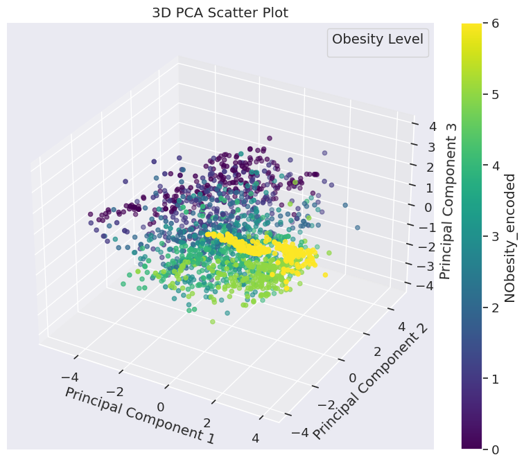

# Obesity-Feature-Analysis
# 🧠 Obesity Levels Classification using Machine Learning

This repository contains an in-depth Machine Learning pipeline for classifying individuals into different obesity levels using a combination of preprocessing, modeling, explainability techniques, and model evaluation. The project was developed as part of the **Applied AI** coursework at Sheffield Hallam University.

---

## 📊 Problem Statement

The objective is to develop a predictive model to classify individuals into one of several obesity levels based on various physiological and lifestyle-related attributes such as age, gender, physical activity, eating habits, etc.

---

## 📁 Dataset Overview

- 📌 **Source**: [UCI ML Repository - Obesity dataset](https://www.kaggle.com/datasets/sagesse123/obesity-dataset)
- 👥 **Samples**: ~2,000 entries
- 🔣 **Target Classes**:
  - Insufficient Weight
  - Normal Weight
  - Overweight Level I
  - Overweight Level II
  - Obesity Type I
  - Obesity Type II
  - Obesity Type III

- 🧾 **Features**:
  - Gender
  - Age
  - Height
  - Weight
  - Family History
  - Physical Activity
  - Daily Meals
  - Transportation used
  - And more...

---

## ⚙️ Project Pipeline

### 1. 🧼 Data Preprocessing
- Label encoding and one-hot encoding for categorical variables
- Handling missing values (if any)
- Feature scaling using StandardScaler
- PCA (Principal Component Analysis) for dimensionality reduction and visualization

### 2. 🔍 Exploratory Data Analysis (EDA)
- Distribution plots and boxplots
- Correlation matrix heatmaps
- Pair plots by obesity level

### 3. 📈 Model Training & Evaluation
- ✅ Base Models:
  - Random Forest
  - Support Vector Machine
  - XGBoost
- 🔨 Custom Model:
  - Random Forest from scratch (built using NumPy)
- 🔍 Hyperparameter Tuning using GridSearchCV
- 📊 Evaluation:
  - Accuracy, Precision, Recall, F1-Score
  - Confusion Matrix
  - ROC AUC Curves

### 4. 🧠 Explainability
- **SHAP** (SHapley Additive exPlanations)
- **LIME** (Local Interpretable Model-agnostic Explanations)
- Visual explanations for individual predictions and global feature importance

---

## 📷 Sample Visualizations

### SHAP Summary Plot

### PCA Cluster Plot

### Confusion Matrix (XGBoost)

### Accuracies Bar plot

---

## 🔍 Key Results

| Model               | Accuracy | Precision | Recall | F1-Score |
|--------------------|----------|-----------|--------|----------|
| Random Forest       | 92.1%    | 91.8%     | 91.5%  | 91.6%    |
| SVM (RBF Kernel)    | 88.7%    | 87.9%     | 87.5%  | 87.6%    |
| XGBoost             | **93.4%**| **93.2%** | **93.1%**| **93.2%**|
| Custom RF (Scratch) | 87.0%    | 86.2%     | 85.9%  | 86.0%    |

---

---

## 🔍 Feature Selection Insights

During the preprocessing and analysis phase, we applied a range of feature selection techniques, including:

- **Correlation Matrix Analysis**
- **Principal Component Analysis (PCA)**
- **Model-based Feature Importances** using Random Forest and XGBoost
- **Model-Agnostic Methods** like SHAP and LIME

### ✅ Key Findings:
- Lifestyle-related features such as:
  - `FAF` (Consumption of high-calorie food),
  - `FCVC` (Vegetable intake frequency),
  - `TUE` (Technology usage time),
  - and `CALC` (Alcohol consumption),
  had the highest impact on model predictions.
- SHAP analysis revealed that high-tech usage combined with low physical activity and poor diet significantly increased obesity risk.
- PCA showed that even after reducing dimensionality, the top 2–3 components captured most of the variance, validating the redundancy of several features.

---

### 🌍 Real-world Applications:
- **Healthcare Dashboards**: Flag early signs of obesity risk using a compact set of lifestyle-based indicators.
- **Wellness Apps**: Generate personalized suggestions using top-ranked predictors.
- **Clinical Trials**: Stratify participants or assess behavioral interventions using a reduced feature set.
- **Public Policy**: Guide national surveys and campaigns based on the most influential lifestyle behaviors.

---
